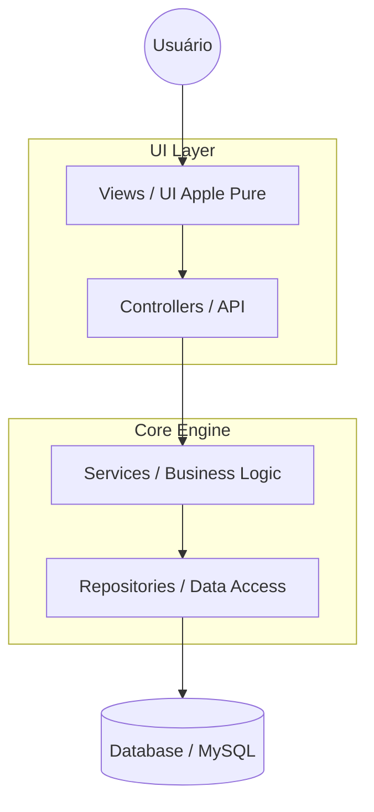

# 🍏 Brasallis Hub 360 - Developer Edition


Bem-vindo ao **Brasallis Hub**, uma plataforma de gestão empresarial (ERP) SaaS de alta performance. Este documento foi projetado especificamente para **colaboradores e desenvolvedores** que desejam manter a excelência técnica e estética do ecossistema Brasallis.

---

## 🏛️ Arquitetura e Fluxo de Dados

O sistema utiliza uma arquitetura desacoplada baseada no padrão **Service-Repository**, garantindo que a lógica de negócio seja independente do meio de persistência.



### Camadas Principais:
- **Core**: Contém o motor do sistema, gerenciamento de sessões e roteamento básico.
- **Modules**: Onde a mágica acontece. Cada funcionalidade (Estoque, Financeiro, RH) reside aqui.
- **Services**: Responsáveis por validações complexas e orquestração de processos.
- **Repositories**: Única camada com autorização para ler/escrever no banco de dados.

---

## 🛠️ Onboarding: Configurando o Ambiente

Para garantir a paridade entre ambientes, recomendamos fortemente o uso do **Docker**.

### Opção 1: Via Docker (Preferencial)
1. **Clone & Install**:
   ```bash
   git clone https://github.com/loombardo-99/erp-wiseflow.git
   cd erp-wiseflow
   ```
2. **Environment**:
   Copie o arquivo de exemplo e ajuste se necessário (o padrão Docker já funciona out-of-the-box):
   ```bash
   cp .env.example .env
   ```
3. **Up**:
   ```bash
   docker-compose up -d
   ```
4. **Dependências**:
   ```bash
   docker exec -it brasallis-server composer install
   ```
5. **Acesso**: `http://localhost:8001`

### Opção 2: Localhost (XAMPP/WAMP)
- **PHP**: Mínimo 8.0.
- **Extensões**: PDO MySQL, OpenSSL, CURL.
- **Database**: Crie um banco `gerenciador_estoque` e utilize o script `configurar_banco_dados.php` para o setup inicial.
- **Composer**: Execute `composer install` para registrar o Autoloader PSR-4.

---

## 🎨 Manual de Estilo Brasallis (Identity)

A identidade visual Brasallis baseia-se no princípio **Apple Pure**: interfaces que não parecem software, mas sim ferramentas nativas e fluidas.

### 1. Tokens de Design
| Elemento | Valor / Token | Descrição |
| :--- | :--- | :--- |
| **Primary Color** | `#2563eb` | Azul Brasallis (Confiança e Tecnologia) |
| **Surface** | `#ffffff` | Branco Sólido ou Glassmorphism (Transparência) |
| **Font Family** | `'Outfit', sans-serif` | Tipografia geométrica moderna |
| **Border Radius** | `8px` a `28px` | Cantos suaves (estilo iOS Sheets) |
| **Tracking** | `-0.15px` | Espaçamento de letra condensado (estilo Apple UI) |

### 2. UI Physics (Animação)
Novos componentes devem evitar transições lineares. Use sempre:
- **Cubic Bezier**: `transition: all 0.3s cubic-bezier(0.4, 0, 0.2, 1);`
- **Hover Scale**: No hover de botões/cards, aplique `scale(1.02)` com física de mola.

### 3. Hierarquia de Informação
- **Negative Space**: Priorize o espaço em branco. Se a tela parecer "cheia", ela não é Brasallis.
- **Micro-interações**: Badges de status devem ser sutis, sem bordas ou sombras pesadas.

---

## 🗺️ Mapa do Projeto para Colaboradores

```text
/admin       -> Views administrativas (Padrão Legado em transição)
/api         -> Endpoints AJAX e integrações externas
/assets      -> Core CSS (brasallis-hub.css) e JS utilitários
/config      -> Arquivos de configuração de sistema e rotas
/docs        -> Manuais de treinamento e marketing
/includes    -> Componentes reutilizáveis (Header, Footer, Nav)
/modules     -> NÚCLEO: Implementações das novas funcionalidades
/src         -> Classes PHP (PSR-4): Services e Repositories
/views       -> Páginas modernas renderizadas pelo Controller
```

---

## 🤝 Como Contribuir

1. **Crie uma Feature Branch**: `git checkout -b feature/nome-da-melhoria`.
2. **Respeite o Design System**: Utilize as classes do `brasallis-hub.css` sempre que possível.
3. **Sem Hardcoding**: Use o sistema de configuração `.env` para chaves e URLs.
4. **Commits Padronizados**: Preferencialmente use o prefixo `feat:`, `fix:`, `refactor:` ou `docs:`.

---
*Este sistema é o coração operacional da Brasallis. Desenvolva-o com paixão pela simplicidade.*
