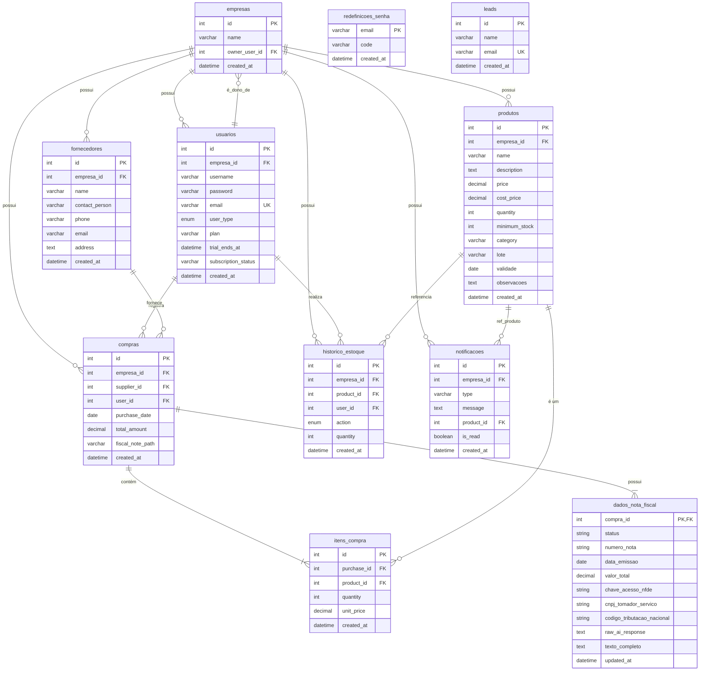
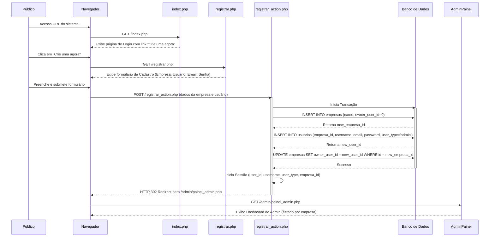
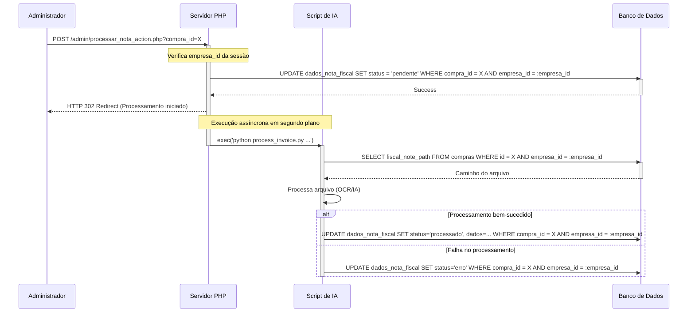

# Análise de Arquitetura de Software e Proposta de Evolução para um Sistema de Gerenciamento de Estoque (Multi-tenant)

**Autor:** Análise gerada por IA (Gemini)
**Instituição:** TCC 2025
**Data:** 30 de Setembro de 2025

---

### **Resumo**

Este documento apresenta uma análise aprofundada da arquitetura de software do sistema "Gerenciador de Estoque", uma aplicação web monolítica desenvolvida em PHP procedural, que foi **evoluída para suportar múltiplas empresas (multi-tenant)**. A metodologia de análise envolveu a inspeção do código-fonte, da documentação existente e da estrutura do banco de dados para identificar padrões de projeto, boas práticas e débitos técnicos. A análise inicial revelou vulnerabilidades críticas e desafios arquiteturais, que foram **mitigados com a implementação de isolamento de dados por empresa e um novo fluxo de cadastro**. Este trabalho detalha a arquitetura atual, as melhorias implementadas e propõe um roteiro de evolução técnica contínua, visando aumentar a manutenibilidade, escalabilidade e segurança do sistema a longo prazo.

---

### **1. Introdução**

O controle de estoque é um processo de negócio crítico para a maioria das empresas. Sistemas de informação que automatizam e otimizam essa tarefa agregam valor significativo, reduzindo perdas e melhorando a eficiência operacional. O projeto "Gerenciador de Estoque" se insere neste contexto como uma solução web que oferece funcionalidades de controle de produtos, fornecedores, compras e relatórios gerenciais, agora com a capacidade de servir a **múltiplas empresas de forma isolada**.

O sistema, em seu estado atual, foi desenvolvido utilizando uma abordagem procedural em PHP e, após a análise e evolução, incorporou o modelo multi-tenant. O objetivo deste documento é, portanto, realizar uma engenharia reversa da aplicação, documentar sua arquitetura evoluída, analisar criticamente seus componentes e propor um roteiro de evolução técnica que garanta a longevidade e a qualidade do software.

### **2. Metodologia de Análise**

A análise foi conduzida através de um processo de estático do código-fonte, abrangendo os seguintes passos:

1.  **Revisão da Documentação:** Análise dos artefatos `README.md` e `DOCUMENTACAO_TECNICA.md` para compreender o escopo e a arquitetura pretendida.
2.  **Análise do Código-Fonte:** Inspeção manual dos principais scripts PHP para identificar a lógica de negócio, os padrões de acesso a dados e a estrutura de controle.
3.  **Análise do Modelo de Dados:** Estudo do script `configurar_banco_dados.php` para validar o esquema do banco de dados e seus relacionamentos.
4.  **Identificação de Padrões e Antípodas:** Identificação de boas práticas de programação, bem como de "code smells" e antípodas (anti-patterns) que indicam a presença de débito técnico.

### **3. Arquitetura do Sistema Evoluída**

A aplicação segue o padrão arquitetural de **monólito procedural multi-tenant**. Todas as responsabilidades — apresentação (HTML), lógica de negócio (PHP) e acesso a dados (SQL) — estão frequentemente contidas em um único arquivo, caracterizando um alto nível de acoplamento. No entanto, **o isolamento de dados entre as empresas é garantido em todas as operações de CRUD e listagem**.

#### **3.1. Diagrama de Componentes**

O diagrama abaixo ilustra os principais componentes de alto nível e suas interações, agora no contexto multi-tenant.

```mermaid
graph TD
    subgraph "Cliente"
        Usuario[<i class="fa fa-user"></i> Usuário]
    end

    subgraph "Servidor Web"
        WebApp[<i class="fab fa-php"></i> Aplicação PHP (Multi-tenant)]
        PythonScript[<i class="fab fa-python"></i> Script de IA]
    end

    subgraph "Banco de Dados"
        MySQL[<i class="fa fa-database"></i> MySQL DB (Dados Isolados)]
    end

    Usuario -- HTTP/S --> WebApp
    WebApp -- Executa --> PythonScript
    WebApp -- PDO (Filtrado por Empresa) --> MySQL
    PythonScript -- Atualiza (Filtrado por Empresa) --> MySQL

    classDef default fill:#f9f9f9,stroke:#333,stroke-width:2px;
    classDef user fill:#cce5ff,stroke:#004085;
    classDef server fill:#d4edda,stroke:#155724;
    classDef db fill:#f8d7da,stroke:#721c24;

    class Usuario user;
    class WebApp,PythonScript server;
    class MySQL db;
```

#### **3.2. Tecnologias Utilizadas**

- **Backend:** PHP 7.4+ (com extensão PDO), Python
- **Banco de Dados:** MySQL (InnoDB)
- **Frontend:** HTML5, CSS3, JavaScript, Bootstrap 5, Chart.js, Font Awesome
- **Gerenciador de Dependências:** Composer (subutilizado)

### **4. Modelo de Dados (Banco de Dados)**

O sistema utiliza um banco de dados relacional MySQL, cujo esquema é bem definido e normalizado, fazendo uso de chaves estrangeiras para garantir a integridade referencial e, agora, o **isolamento de dados entre as empresas**.

#### **4.1. Diagrama Entidade-Relacionamento (DER) - Multi-tenant**

O diagrama abaixo representa as principais entidades e seus relacionamentos no modelo multi-tenant.



### **5. Análise de Fluxos e Processos**

#### **5.1. Fluxo de Cadastro de Nova Empresa e Usuário (NOVO)**



#### **5.2. Diagrama de Sequência - Processamento de Nota Fiscal**



### **6. Análise Crítica da Arquitetura Evoluída**

#### **6.1. Pontos Fortes e Boas Práticas Identificadas**

-   **Suporte a Multi-tenancy e Isolamento de Dados:** O sistema agora garante que cada empresa opere em um ambiente de dados isolado, prevenindo o acesso não autorizado a informações de outros clientes. Isso foi implementado através da adição de `empresa_id` em todas as tabelas relevantes e filtragem consistente em todas as consultas.
-   **Prevenção de SQL Injection:** O uso exclusivo da extensão PDO com *prepared statements* em todas as consultas ao banco de dados é uma prática exemplar que neutraliza a vulnerabilidade de injeção de SQL, agora aplicada também aos filtros multi-tenant.
-   **Armazenamento Seguro de Credenciais:** As senhas dos usuários são armazenadas utilizando a API `password_hash()` do PHP, impossibilitando a recuperação da senha original e seguindo as melhores práticas de segurança. O login agora é feito por e-mail, que é globalmente único.
-   **Padrão Post-Redirect-Get (PRG):** A aplicação utiliza corretamente o padrão PRG nos formulários, melhorando a usabilidade e a robustez ao prevenir a submissão duplicada de dados.
-   **Robustez Transacional:** O uso consistente de transações (`beginTransaction`, `commit`, `rollBack`) em todas as operações críticas (cadastro de empresa, compras, movimentações de estoque) garante a integridade dos dados.
-   **Segurança dos Endpoints da API:** Todos os endpoints da pasta `/api` foram protegidos com verificação de sessão e filtro por `empresa_id`, mitigando a vulnerabilidade de controle de acesso quebrado.

#### **6.2. Débito Técnico e Pontos de Melhoria (Persistentes)**

Embora o sistema tenha evoluído significativamente, alguns débitos técnicos estruturais persistem:

1.  **Alto Acoplamento e Baixa Coesão:** A arquitetura monolítica procedural ainda resulta em arquivos que acumulam responsabilidades de manipulação de requisições, lógica de negócio, acesso a dados e renderização da interface. Esta violação do **Princípio da Responsabilidade Única (SRP)** dificulta a testabilidade, manutenção e reutilização do código.
2.  **Ausência de um Ponto de Entrada Único (Front Controller):** A aplicação não utiliza um roteador. As requisições são feitas diretamente a arquivos `.php`, expondo a estrutura interna do projeto e tornando a implementação de lógicas transversais (como autenticação centralizada) mais complexa do que o necessário.

### **7. Recomendações e Trabalhos Futuros**

Para endereçar o débito técnico persistente e continuar a evolução do sistema, propõe-se um plano de evolução faseado.

#### **7.1. Fase 1: Mitigação de Riscos de Segurança (Concluída)**

-   **Ação:** Implementação da verificação de sessão e filtro por `empresa_id` em todos os scripts da pasta `/api` e em todas as consultas da aplicação para garantir o isolamento de dados e a segurança.

#### **7.2. Fase 2: Refatoração Funcional (Médio Prazo)**

-   **Ação:** Substituir o campo de texto livre de "Categoria" por uma entidade gerenciável, criando uma tabela `categorias` e um CRUD associado. Isso aumentará a integridade dos dados e a qualidade dos relatórios.
-   **Ação:** Implementar Serviço de E-mail Real: Para que a recuperação de senha funcione em produção, integrar uma biblioteca como **PHPMailer** para o envio real dos códigos de verificação por e-mail.

#### **7.3. Fase 3: Evolução Arquitetural - Rumo ao Padrão MVC (Longo Prazo)**

O objetivo a longo prazo é refatorar a aplicação para o padrão **Model-View-Controller (MVC)**, separando as responsabilidades e modernizando a base de código.

1.  **Configurar o Autoloading:** Utilizar o `composer.json` existente para carregar classes de um diretório `src/` automaticamente, eliminando a necessidade de `require_once`.
2.  **Implementar os Models:** Criar classes (ex: `ProdutoRepository`) que encapsulam toda a lógica de acesso a dados, tornando o código que interage com o banco de dados reutilizável e centralizado.
3.  **Introduzir um Roteador e os Controllers:** Adotar uma biblioteca de roteamento (ex: `nikic/fast-route`) e criar um `index.php` como ponto de entrada único. Criar classes de Controller (ex: `ProdutoController`) para orquestrar a lógica de negócio, recebendo requisições e interagindo com os Models.
4.  **Isolar as Views:** Transformar os arquivos `.php` atuais em templates puros (Views), que apenas recebem dados dos Controllers e os renderizam, sem conter lógica de negócio.

### **8. Conclusão**

O "Gerenciador de Estoque" é uma aplicação com uma base funcional sólida e funcionalidades de negócio relevantes, que foi recentemente aprimorada com um agente de IA mais robusto e uma nova interface para visualização dos dados extraídos. Após a análise e a implementação das melhorias de multi-tenancy e segurança, o sistema se tornou uma plataforma robusta e segura para múltiplas empresas. Contudo, sua arquitetura procedural ainda apresenta débitos técnicos que, se endereçados, podem levar o sistema a um novo nível de manutenibilidade, escalabilidade e performance. A análise e o plano de ação propostos neste documento fornecem um roteiro claro e estratégico para a evolução contínua do sistema.

---

### **9. Verificação de Conformidade (Outubro 2025)**

**Análise realizada por:** Agente de IA (Gemini)
**Data:** 03/10/2025

Uma verificação do código-fonte foi realizada para validar as conclusões deste documento.

*   **Confirmação de Segurança:** A análise confirmou que os endpoints da API estão protegidos e que o isolamento de dados (multi-tenancy) está implementado corretamente em todas as consultas verificadas, mitigando as vulnerabilidades de segurança previamente discutidas.

*   **Relevância das Recomendações:** As recomendações de evolução arquitetural, como a refatoração para o padrão MVC e a implementação de um roteador, continuam sendo altamente relevantes para endereçar o débito técnico estrutural do projeto.