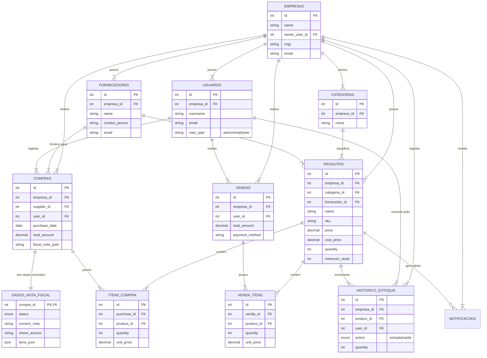

# Modelo Conceitual do Banco de Dados - Gerenciador de Estoque

Este documento descreve o modelo conceitual de dados do sistema Gerenciador de Estoque, detalhando as entidades, seus atributos e os relacionamentos entre elas. O sistema segue uma arquitetura **Multi-tenant**, onde os dados são isolados por empresa.

## Diagrama de Entidade-Relacionamento (ER)

## Dicionário de Dados

### 1. Entidades Principais (Multi-tenant)

Todas as entidades abaixo (exceto Leads e Redefinições de Senha) possuem uma chave estrangeira `empresa_id`, garantindo o isolamento dos dados.

#### **EMPRESAS**
Representa a organização cliente que utiliza o sistema.
- **Atributos:** `id`, `name`, `owner_user_id` (Dono da conta), `cnpj`, `email`, `phone`, `address`.

#### **USUARIOS**
Usuários que acessam o sistema, vinculados a uma empresa.
- **Atributos:** `id`, `empresa_id`, `username`, `email`, `password` (hash), `user_type` (admin ou employee).

#### **PRODUTOS**
O catálogo de itens vendidos ou gerenciados pela empresa.
- **Atributos:** `id`, `empresa_id`, `categoria_id`, `fornecedor_id`, `name`, `sku` (código único), `price` (venda), `cost_price` (custo), `quantity` (estoque atual), `minimum_stock` (ponto de pedido).

#### **CATEGORIAS**
Classificação lógica dos produtos.
- **Atributos:** `id`, `empresa_id`, `nome`.

#### **FORNECEDORES**
Parceiros comerciais de quem a empresa compra produtos.
- **Atributos:** `id`, `empresa_id`, `name`, `contact_person`, `email`, `phone`.

---

### 2. Entidades Transacionais

#### **COMPRAS**
Registro de aquisição de mercadorias.
- **Atributos:** `id`, `empresa_id`, `supplier_id`, `user_id`, `purchase_date`, `total_amount`, `fiscal_note_path` (caminho do arquivo PDF/Imagem).
- **Relacionamentos:**
    - **1:N** com `ITENS_COMPRA` (detalhes dos produtos comprados).
    - **1:1** com `DADOS_NOTA_FISCAL` (dados extraídos pela IA).

#### **ITENS_COMPRA**
Tabela de ligação que detalha *o que* e *quanto* foi comprado.
- **Atributos:** `id`, `purchase_id`, `product_id`, `quantity`, `unit_price`, `stock_at_purchase` (snapshot do estoque).

#### **DADOS_NOTA_FISCAL**
Armazena o resultado do processamento de IA sobre a nota fiscal anexada à compra.
- **Atributos:** `compra_id`, `status` (pendente, processado, erro), `numero_nota`, `data_emissao`, `itens_json` (JSON bruto dos itens identificados).

#### **VENDAS**
Registro de saída de mercadorias.
- **Atributos:** `id`, `empresa_id`, `user_id`, `total_amount`, `payment_method`, `created_at`.
- **Relacionamentos:**
    - **1:N** com `VENDA_ITENS`.

#### **VENDA_ITENS**
Detalhes dos produtos vendidos em uma transação.
- **Atributos:** `id`, `venda_id`, `product_id`, `quantity`, `unit_price`.

#### **HISTORICO_ESTOQUE**
Log de auditoria de todas as movimentações (entradas e saídas).
- **Atributos:** `id`, `empresa_id`, `product_id`, `user_id`, `action` (entrada, saida, ajuste), `quantity`, `new_quantity` (saldo após ação).

---

### 3. Entidades Auxiliares

#### **NOTIFICACOES**
Alertas gerados pelo sistema (ex: estoque baixo).
- **Atributos:** `id`, `empresa_id`, `type`, `message`, `product_id`, `is_read`.

#### **LEADS** (Global)
Registros de interessados no sistema (landing page). Não vinculado a uma empresa específica.
- **Atributos:** `id`, `name`, `email`, `company_name`.

#### **REDEFINICOES_SENHA** (Global)
Tabela temporária para códigos de recuperação de senha.
- **Atributos:** `email`, `code`, `created_at`.
